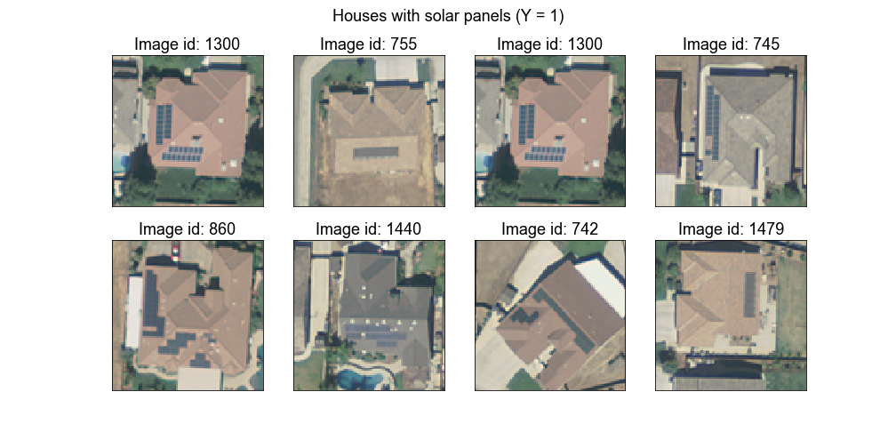
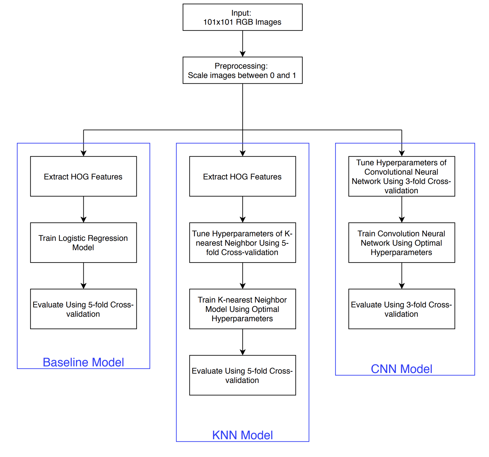
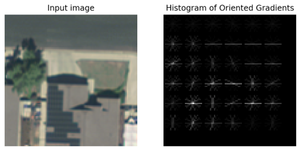
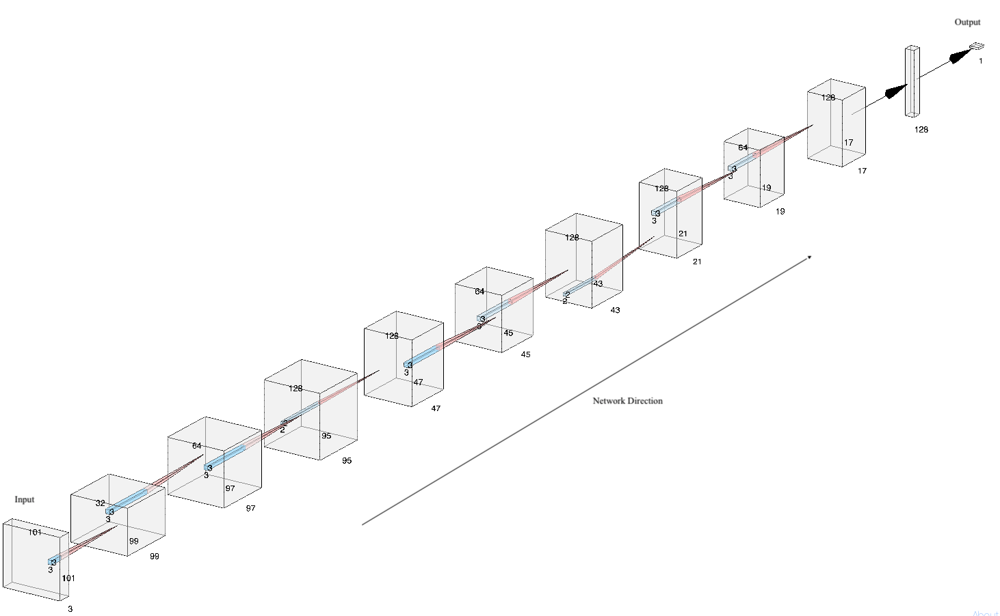
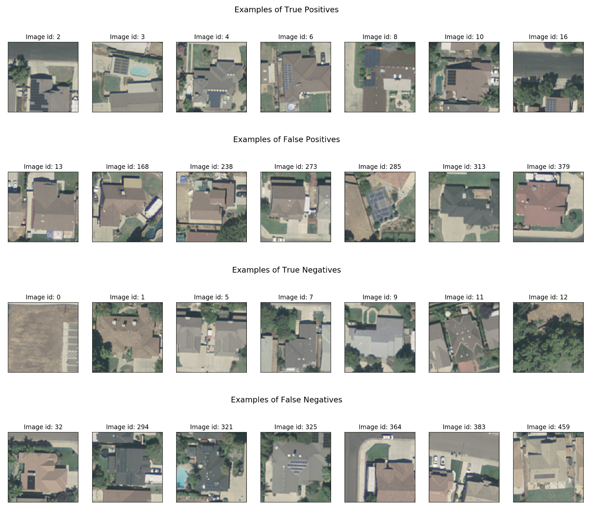
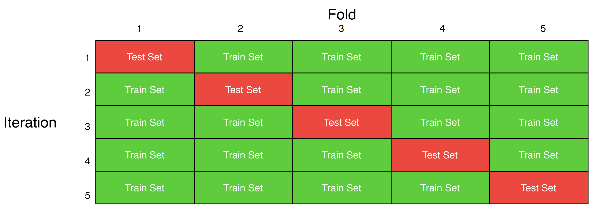

# Abstract

Environmentally friendly energy sources such as solar are becoming more and more popular in the US and other countries. However, we don’t have the necessary data (particularly geospatial data) to study the growth and development of solar energy, peer effects on the diffusion of solar panels,  energy capacity, and other issues. Automating the process of obtaining information about PV installations would contribute to evidence-based decision making in these areas.  Therefore, this study aims to detect solar panels in aerial imagery data through different machine learning classifiers such as logistic regression, k-nearest neighbor (KNN), and convolutional neural network (CNN). This paper demonstrates that despite the high dimensionality of RGB aerial imaginary with different colors, shapes, and sizes of color panels, CNN outperformed logistic regression and KNN and demonstrated a more robust performance.

# 1. Introduction

Reduced prices, solar incentives, investment tax credits, and high effectiveness made environmentally friendly solar energy attractive to millions of Americans. Rooftop solar photovoltaic (PV) installations have increased dramatically in the last decade in the United States (SEIA, 2019). Moreover, according to Solar Energy Industries Associate (SEIA),  U.S. PV capacity is projected to double within the next five years (2019). As solar’s share of total U.S. electrical generation is rapidly increasing, many entrepreneurs and decision-makers are asking questions such as: How much energy is produced by the solar panel? What is their power capacity? Where are they located and why? What are the trends in solar growth and development over time? Besides seeking the answer to these questions, decision-makers might be interested to know if there are peer (social interaction) effects on the diffusion of solar panels in different regions and neighborhoods and if so, what is their impact (Bollinger & Gillingham, 2012).

Thus, it is important to have detailed geospatial information about PV installations. Current data about the above-noted characteristic of solar PV installations is obtained through surveys and utility interconnection filings. Therefore, it is either limited, does not have geospatial data, or is often not available (Malof et al., 2016).

However, with the help of computer vision methods, we can attempt to address the above-noted questions in a relatively fast and scalable way. Obtaining this information about PV installations will enable evidence-based decision making and can be later applied to studies of solar developments in other countries (particularly developing countries).  

The rest of this paper is structured as follows. Section 2 presents a literature review on state-of-the-art methods of computer vision, examples of different recent object detections studies, and prior works on the PV array detection in aerial imaginary. Section 3 describes the data used for this study followed by section 4 that presents methods employed by us. Section 5 describes the results of the algorithms and section 6 presents the conclusion of this study.

# 2. Background

#### 2.1 State-of-the-art Methods in Computer Vision

The growing availability of digital images and the recent acceleration of computing power contributed to the advancement of the computer vision field recently. Object detection is one of the most challenging problems in the field of computer vision and it is an active area of research. Zou et al. (2019) in their paper summarized the key state-of-the-art methods for object detection, which (since 2012) moved toward deep learning methods from the traditional detection methods.

The first CNN that started the deep learning revolution was AlexNet (Zou et al., 2019). It was implemented in 2012 and had eight layers using 5x5 or 7x7 convolutional filters. It was followed by VGG in 2014, which has a 16-19 layers deep network that used small 3x3 convolutional filters instead. GoogLeNet further increased the depth of the network to up to 22 layers and introduced batch normalization and factorizing convolution. He et al (2015) presented the Deep Residual Networks (ResNet) with a significantly deeper network of up to 152 layers that is easier to train, optimize, and that can be more accurate due to the increased depth. In 2017, Huang et al (2018 ) introduced DenseNet that in a feed-forward way connects each layer to every other layer. DenseNet has several advantages over traditional convolutional neural networks, including reduction of parameters, improving feature propagation, reducing computational intensity, and others (Huang et al., 2018). Next Squeeze and Excitation Networks( SENet) was proposed, which integrated global pooling in the architecture. (Hu et al., 2019). SENet outperformed significantly other state-of-the-art CNNs at a slight computational cost (Hu et al., 2019). Lastly, The Generative Adversarial Networks (GAN) was proposed by Goodfellow in 2014 which was empirically proved to improve the detection performance for small and occluded objects (Zou et al., 2019).

 Regarding traditional detection methods, the Histogram of Oriented Gradients (HOG) features in combination with a linear support vector machine (SVM) became a popular technique for many object recognition tasks due to its excellent performance. In their seminal paper, Dalal and Triggs demonstrated that linear SVM classifier trained on HOG featured performed very well for person detection and outperformed Haar detector significantly (2005). However, the researchers pointed out that the presented SVM detector is not as fast as some other methods and did not account for motion information (Dalal & Triggs, 2005).

#### 2.2 Previous Work in Object Detection in Digital Imaginary

There have been numerous studies on object detection in digital imagery for detections of cars, roads, buildings, fruits, and others. For example, the following studies were conducted on the detection of cars in UAV images. Moranduzzo and Melgani (2014) proposed a new method for car detection that used the SVM classifier with two sets of HOG features (for horizontal and vertical directions), which gave good results. In another study on the detection and counting of cars, Ammour et al., (2017) presented a new method using pre-trained CNN together with a linear SVM classifier. Even though it outperformed state-of-the-art methods, it had a high false-positive rate.

In a case of land cover classification, Pelletier et al (2016) employed the Random Forest classifier, which outperformed SVM and had relatively low variance. Whereas for the fruit recognition problem, Nyarko et al. (2018) applied the KNN classifier trained on SHOT and CTI features. It performed very well and has an advantage of computational efficiency. Lastly, Ševo & Avramović ( 2016) used two-stage CNN on UCMerced data that achieved an accuracy of 98.6%, demonstrating the effectiveness of CNNs for object detection tasks.

#### 2.3 Previous Work on PV Array Detection in Aerial Imaginary

There have been a few studies conducted on the detection of solar panels in aerial imaginary. Malof et al. (2015) pioneered a new approach to getting energy information for rooftop solar panels. The imaginary (100 images) was obtained from the U.S. Geologically Survey and was manually labeled. The study showed a detection rate of 94% using the SVM classifier, demonstrating the feasibility and potential of this approach. Further study was conducted on a larger dataset using pixel-wise classification with Random Forest Classifier and different post-processing steps (Malof et al., 2016). The algorithm performed well on a per-pixel basis and is computationally effective; however, it was not very good at assessing the precise shape and size of the PV arrays.

On the other hand, the most recent paper on this subject used a semantic segmentation convolutional neural network (SegNet), which is significantly better at estimating the size and shape of the PV arrays (Camilo et al., 2018). Thus, the study shows progress toward an accurate estimation of power capacity. Moreover, the study demonstrated that SegNet outperformed the VGG CNN as well as CNN proposed earlier by Malof et al. (2017). Lastly, the study by Yuan et al. (2016) addressed large-scale solar panel classification for the first time. They applied deep CNN, which performed very well, demonstrating the effectiveness and scalability of this method for large-scale solar.

# 3. Data

The data provided for this study was constituted by a total of 2058 .tif files each corresponding to an image with a resolution of 101 by 101 pixels. The images are cropped sub-images from aerial satellite photographic data collected in the year 2013 from Fresno, California, a city in the United States with a particularly high number of solar panel installations (Malof et al., 2016). Each image has a resolution of 0.3 meters per pixel and has been ortho-rectified.

A total of 1500 images have labels indicating whether they have a solar panel (Y = 1) or not (Y = 0), and the other 558 images were given without a label to evaluate the performance of the model on unseen data. The proportion of images with solar panels is 33.7% demonstrating an unbalance in the target class. The images were in color, meaning that each unit of observation had three color channels to work with: red, green and blue. Hence, the resulting array of pixels was 101 x 101 x 3 in dimension. As shown in Figures 1 and 2, the images depict aerial satellite views of houses either with or without solar panels on its rooftops.

As we can see in Figure 1, the size, shapes and color tones of the solar panels vary significantly. For instance, image 1479 shows a solar panel with a soft grey color and a rectangular shape. In contrast, image 860 shows a pair of solar panels with an irregular shape and a darker tone of grey (most likely black). In the case of houses without solar panels, shown in Figure 2, there are shapes and objects that could be confounded as solar panels. Take as an example of image 739, in which we can see a black rectangle in the center of the image that could be misclassified as a solar panel because of its shape and color. Another good example is image 285, which depicts a black object, most likely a basketball court, that could be mistakenly classified as a solar panel, given its black color and the white lines inside it. All of these different shapes and color variations of solar-panel-like objects should be addressed to produce a robust classifier. Further in this paper, we will present potential solutions to the challenges depicted above, focusing particularly on methods that allow us to detect rectangular shapes by applying mathematical filters to the images.

{width=60%}

{width=60%}

# 4. Methods

#### 4.1 Overview

Based on the literature review, we tried several machine learning techniques to tackle the problem of detecting solar photovoltaic array in aerial imagery. Figure 3 shows a flowchart of the methodology that we followed.

{width=90%}

All the 1500 images were preprocessed by scaling each pixel of each image to a number between 0 and 1. This type of scaling helps the cost functions in machine learning models to converge faster. Then, we trained a baseline model (shown on the left-most branch in the flowchart in Figure 3) which consisted of a simple logistic regression model trained on the HOG features. The details of the HOG are provided in section 4.2. The baseline model gives us a good starting point to tackle the solar panel detection problem by providing a metric that we can use to compare its performance to the more involved models noted below. We evaluated our models by computing area under the curve (AUC) in the receiver operating characteristic (ROC) curve. Since the target class is imbalanced, AUC gives a robust measure of the performance of a machine learning model because AUC is high when both the true positive and true negative rates are high.

Next, we trained a KNN model on HOG features, and a convolutional neural network, which automatically does feature extraction. We used 5-fold cross-validation to evaluate our classifiers and to choose the optimal set of hyperparameters. It is important to note that we used 3-fold cross-validation for CNN because of computational constraints. Details of cross-validation and hyperparameter tuning are given in Appendix A.

#### 4.2 KNN

We used a two-step strategy to detect solar PV in the given images. First, we used a feature extraction algorithm to reduce the dimensionality of the feature space, which in our case is too large to handle by conventional machine learning models. Then, we used the extracted features as predictors along with the image labels to train a supervised machine learning model.

In the first stage, we adopted HOG, as a feature extraction method. As noted in the literature review, features from HOG have been proposed as a local feature for object detection and are recognized to be prevalent features for object detection tasks. Although HOG is vulnerable to changes in the size or rotation of a target object in an image, it generally performs well for the objects with similar sizes (Dalal et al., 2005). Moreover, in images with objects of similar sizes, HOG features are considered to be robust against changes in the brightness of objects (Dalal et al., 2005).  In our study, our input data are fixed-size images and have the same scales, implying that the sizes of objects are relatively similar. Hence, HOG is an appropriate feature descriptor for our problem. HOG groups pixels into regions (cell with a size of 15x15) so that features can be computed on regions of an image rather than looking at individual pixels in isolation. In Figure 4, each region in the picture is represented as white lines in the same boundaries of a cell. The lines indicate the differences of gradients between neighboring pixels.

{width=50%}

The HOG has two major hyperparameters: the orientation and the region size. The orientation decides the number of directions considered for calculating the gradient change. For example, if orientation is set to one, gradients are measured in the horizontal direction. If the orientation is set to two, the gradients are measured in the horizontal as well as the vertical directions and so on. The gradients are computed over a region in the image. Specifying the correct region size is not a trivial task as it requires one to look at the object size, location, and orientation. Using a correct set of values for these hyperparameters can help HOG to be invariant with regards to location, brightness, and size. Bearing all the above, we experimented with various values for the orientation and the region size parameters.

In the second stage, we applied several classifiers to the HOG features. Based on the literature, we decided to apply SVM, KNN, and Random Forest classifiers which proved to work well with  HOG extracted features. We found that the KNN classifier works best among the models we tried out. Therefore, we reported the results of this model in this paper. 

For the KNN model, in particular, we first needed to choose a set of hyperparameters before training the algorithm. We experimented with the number of neighbors (1 to 30) to consider while computing the distance between a test data point and a training data point. We also tried different distance metrics (Manhattan or Euclidean) and whether the effect of a neighbor in determining the class for a test data point should be weighted by the distance between the test point and a neighbor. Finally, we tuned the hyperparameters by randomly sampling from hyperparameters space and evaluating the performance using 5-fold cross-validation (details of hyperparameter tuning are in Appendix A).

#### 4.3 CNN

Artificial neural networks (ANNs) have proven to be successful in automating various types of tasks.  Convolutional neural networks (CNNs) are a type of ANNs that are extensively used in computer vision. Unlike a vanilla ANN, a CNN preserves the spatial structure of an image and looks at the image the way humans look at it. As a result, CNNs have achieved state-of-the-art results in many computer vision-related tasks today, as mentioned in the literature review.

To detect solar PV from aerial imagery, we used a CNN with an input layer, seven convolutional layers, and an output layer. Figure 5 shows the architecture of the CNN that we used. A table summarizing the network shown in Figure 5 is presented in section 3 of Appendix A. Each convolution operation is followed by a ReLu activation and batch normalization because both these techniques have proved to be effective in handling the vanishing gradient problem and helping the cost function converge quickly. While training CNN, we provided more weightage to the minority class 1 which significantly improved the AUC as compared to when there was equal weightage provided to both classes.

Unlike the KNN model, a CNN has many hyperparameter choices such as number of layers, number of filters in each layer, the activation function, optimizing function, regularization, learning rate, and others. We started with a 2-layer CNN (input layer, hidden layer, and output layer) with 16 filters and a kernel size of 3x3. The choice for the filter size was based on popular image classifiers such as VGGNet that uses a filter of size 3x3. We also experimented with other filter sizes such as 5x5 and 7x7 but 3x3 seemed to work best in this image classification task. After deciding the filter size and activation function, we subsequently increased the number of layers and the number of filters simultaneously until we saw signs of overfitting. We found that a CNN with seven convolution layers that has global max pooling at the end works best for our image classification task rather than having a fully-connected layer at the end of the network. Specifically, by using a fully-connected layer at the end of the network, we lose the spatial information of the image. Whereas by using a global max-pooling layer at the end of the network, we ensure that the spatial information is not lost when the representation of the image is fed into the output layer.

# 5. Results

#### 5.1 Baseline Model

The logistic regression model trained on HOG features resulted in an AUC score of  0.718. The ROC curve for the model is shown in Figure 6 (blue curve). The model seems to do well in terms of balancing the true-positive and false-positive rates. However, as compared to other presented models, the baseline model performs worse. As we can see from Figure 6, it seems that the algorithm (blue curve) is struggling to achieve a good balance between precision and recall shown by the blue line in the PR curve plot. We will compare the performance of other models with this baseline model.

{width=80%}

#### 5.2 KNN

As a result of the iterative process explained in the methods section, we found that the optimal value of K-neighbors for the HOG-KNN pipeline was 5. As for the distance metric, L1 performs better in this context. Moreover, when choosing the type of weighing, we found that weighting a neighbor based on its distance outputted the most satisfactory results.

The KNN model with optimal hyperparameters based on our experiments resulted in an AUC score of 0.812 as shown in the green curve in Figure 6. The model outperformed the baseline model significantly. It achieved a higher true positive rate (TPR) and true negative rate (TNR) at every threshold compared to the baseline model. We can also see from the PR curve in Figure 6 that the KNN model (green curve) achieved a better balance between precision and recall than the baseline model (blue curve).

Even though the model performs relatively well, it has misclassifications, which can be seen in Figure 7 below. We can see that this model performs relatively better when the solar panel and the rooftop formed a greater color contrast and there is no similar contrast existing in the picture. False-positive predictions are cases where there is no solar panel in the picture but our model predicts there is. We can see that if there is any similar contrast existing in the picture (even when it is not) due to the appearance of solar panels (for example the shade of the house looks similar to the color of the solar panel), the model is likely to predict there is a solar panel in the picture. On the other hand, false-negative prediction examples are those cases where there is a solar panel in the picture but our model predicts there is none. We can see that if the contrast between the color of the solar panel and the color of the rooftop is much smaller or much greater, the model might misclassify.

{width=60%}

#### 5.3 CNN

Our final CNN model with optimal hyperparameters achieves an AUC score of 0.992 based on 3-fold cross-validation. The performance of our CNN model was significantly better than the KNN model as can be seen from the ROC and PR curves in Figure 6 (red curve).

Even though the model has a very robust performance, it has several false positives and false negatives as shown in Figure 8.  It seems that in most of the false-negative cases, the solar PVs are either represent a small portion of the image (image id: 364 and 383), or the color is not easily distinguishable (image id 32, 294 and 321) because it matches the surroundings such as roof color or color of a shadow. Whereas in the false-positive case, the CNN mistakes the shadows and dark colors for solar panels. For instance, the image with a dark-gray basketball court (image id: 285) is classified as having a solar panel. Similarly, the CNN misclassified the image with a dark-gray colored roof (image id: 313) as having a solar panel. On the other hand, if we look at the true positives, the CNN seems to perform well when the color contrast between the roof and the solar panel is high.

{width=60%}

# 6. Conclusion

Having the accurate detection of solar panels in aerial images as the key focus of this study.  With this in mind, we tested different methodologies to approach this task using machine-learning-based computational methods. Our pipelines sought to solve the most prominent challenges of solar panel detection by extracting key features of the images either by using hand-crafted methods such as HOG or by using automatic feature creation methods such as CNN. These feature engineering approaches intended to put more focus on aspects like edge detection and shape detection to isolate the core information present on each observation and feed our algorithms with relevant features.

Our best performer non-CNN pipeline was HOG-KNN, showing a significant increase in performance compared to its alternatives (Random Forest and SVM) as well as compared to our baseline pipeline HOG-Logistic. Nonetheless, our CNN approach outperformed all the later by being able to work with the full set of information in the images (3 RGB channels). The CNN model incorporates the feature extraction philosophy of the HOG within its convolutions and can spot more complex patterns in the images by scanning them through a multilayer architecture.

By using the convolutional neural networks method we approached the performance of state of the art methods when it comes to object detection, and effectively proposed an efficient and cost-effective way for governments and private organizations to census the usage of alternative sources of energy in pre-defined geographical areas.

However, it is important to note some important aspects that should be addressed to choose a definite approach to this problem. While CNN methods are indeed better than pipelines integrating HOG, their long training process poses significant challenges to the practical application of these solutions in industry or government settings. Another potential challenge related to applying CNN methods to this problem is their need for a high amount of training data. Nonetheless, we think this case, in particular, would not be affected by this given the widespread availability of satellite aerial imagery, while also being aware that finding labeled data of this kind remains to be a significant logistical challenge.

In regards to further research paths, we suggest that further studies using this data should take into account the class imbalance of the dataset by increasing the sample of positive cases (Presence of solar images). Also, to address the generalization potential of this study, eventual efforts should focus on gathering data from additional geographical sources, not only California but also other states in the USA and even images from other countries.

\newpage

# Roles

* **Amandeep Rathee**: I was the team leader for this assignment and I performed the following tasks:
     - Train and validate various CNN models and submit the one that has the highest AUC on the test set. My code achieved 0.984 on the final leaderboard on Kaggle.
     - Make sure that the team collaborates on GitHub and learn the basics of version control.
     - Write the methods and results for the CNN model.
     - Write the overview subsection in the methods section.
     - Create all the visuals used present in the methods and results section of the report such as images, flowcharts, diagrams, tables, ROC and PR curves.
     - Take care of logistics of project development such as aggregating all the code that different team members wrote and put it in a single well-commented file for submission, and putting the contents of the report together in a markdown format.

* **Alena Kalodzitsa**: My role was to further improve our initial CNN used for Kaggle competition. I built three layers CNN with Keras, utilizing batch normalization and max pooling.  I have made four submissions on Kaggle with the  highest AUC of 0.88. With regards to the report, I wrote an abstract, introduction, and background sections. Also reviewed the report thoroughly before submission and provided valuable feedback related to technical details and presentation of work.

* **Juan David Martinez Gordillo**: My role was to begin the development of our first Convolutional Neural Networks (CNN) model. I started to test out the performance of a CNN architecture by using Google Colab GPU accelerated notebooks and TensorFlow. My first model designs ignited our initial steps at the Kaggle competition leaderboard reaching an AUC of 0.84 after six submissions. In regards to the drafting of the report, I took responsibility for the data description and conclusions sections.

* **Shota Takeshima**: My role was to construct a non-CNN predictive model, HOG + KNN, with Xiao. I have tried to use other feature extraction methods, such as PCA. However, after evaluations of the combination of these features extraction methods and classifiers, we found the HOG + KNN model eventually is better. Also, in this report writing, I was in charge of section 5.1, which is about the method of the model.

* **Xiao Lu**: My role is to build the HOG+KNN (non-CNN) model. I identified how to leverage HOG as a better feature extraction tool for the image data and found the appropriate parameters for HOG. I built the KNN model based on the random search result done by Shota and this non-CNN model reaches an AUC of 0.807. I also built the baseline model and compared the performance of non-CNN model with this baseline model. In regards to the drafting of the report, I wrote the result of the HOG+KNN model and tried to understand where and why this model performs better and worse.

\newpage

# References
Ammour, N., Alhichri, H., Bazi, Y., Benjdira, B., Alajlan, N., & Zuair, M. (2017). Deep Learning Approach for Car Detection in UAV Imagery. Remote Sensing, 9(4), 312. https://doi.org/10.3390/rs9040312

Bollinger, B., & Gillingham, K. (2012). Peer Effects in the Diffusion of Solar Photovoltaic Panels. Marketing Science, 31. https://doi.org/10.2307/23361417

Goldberger, J., Roweis, S., Hinton, G., & Salakhutdinov, R. (n.d.). Neighbourhood Components Analysis. 8.
Camilo, J., Wang, R., Collins, L. M., Bradbury, K., & Malof, J. M. (2018). Application of a semantic segmentation convolutional neural network for accurate automatic detection and mapping of solar photovoltaic arrays in aerial imagery. ArXiv:1801.04018 [Cs]. http://arxiv.org/abs/1801.04018

Dalal, N., & Triggs, B. (2005). Histograms of oriented gradients for human detection. 2005 IEEE Computer Society Conference on Computer Vision and Pattern Recognition (CVPR’05), 1, 886–893 vol. 1. https://doi.org/10.1109/CVPR.2005.177

Hu, J., Shen, L., Albanie, S., Sun, G., & Wu, E. (2019). Squeeze-and-Excitation Networks. ArXiv:1709.01507 [Cs]. http://arxiv.org/abs/1709.01507

Huang, G., Liu, Z., van der Maaten, L., & Weinberger, K. Q. (2018). Densely Connected Convolutional Networks. ArXiv:1608.06993 [Cs]. http://arxiv.org/abs/1608.06993

Malof, J. M., Bradbury, K., Collins, L. M., & Newell, R. G. (2016). Automatic Detection of Solar Photovoltaic Arrays in High Resolution Aerial Imagery. Applied Energy, 183, 229–240. https://doi.org/10.1016/j.apenergy.2016.08.191

Malof, J. M., Collins, L. M., & Bradbury, K. (2017). A deep convolutional neural network, with pre-training, for solar photovoltaic array detection in aerial imagery. 2017 IEEE International Geoscience and Remote Sensing Symposium (IGARSS), 874–877. https://doi.org/10.1109/IGARSS.2017.8127092

Malof, J. M., Rui Hou, Collins, L. M., Bradbury, K., & Newell, R. (2015). Automatic solar photovoltaic panel detection in satellite imagery. 2015 International Conference on Renewable Energy Research and Applications (ICRERA), 1428–1431. https://doi.org/10.1109/ICRERA.2015.7418643

Moranduzzo, T., & Melgani, F. (2014). Detecting Cars in UAV Images With a Catalog-Based Approach. IEEE Transactions on Geoscience and Remote Sensing, 52(10), 6356–6367. https://doi.org/10.1109/TGRS.2013.2296351

Nyarko, E. K., Vidović, I., Radočaj, K., & Cupec, R. (2018). A nearest neighbor approach for fruit recognition in RGB-D images based on detection of convex surfaces. Expert Systems with Applications, 114, 454–466. https://doi.org/10.1016/j.eswa.2018.07.048

Pelletier, C., Valero, S., Inglada, J., Champion, N., & Dedieu, G. (2016). Assessing the robustness of Random Forests to map land cover with high resolution satellite image time series over large areas. Remote Sensing of Environment, 187, 156–168. https://doi.org/10.1016/j.rse.2016.10.010

SEIA. (2019). SEIA. /us-solar-market-insight

Ševo, I., & Avramović, A. (2016). Convolutional Neural Network Based Automatic Object Detection on Aerial Images. IEEE Geoscience and Remote Sensing Letters, 13(5), 740–744. https://doi.org/10.1109/LGRS.2016.2542358

Toshev, A., Taskar, B., & Daniilidis, K. (2012). Shape-based object detection via boundary structure segmentation. International Journal of Computer Vision, 99(2), 123-. Gale Academic OneFile.

Yuan, J., Yang, H.-H. L., Omitaomu, O. A., & Bhaduri, B. L. (2016). Large-scale solar panel mapping from aerial images using deep convolutional networks. 2016 IEEE International Conference on Big Data (Big Data), 2703–2708. https://doi.org/10.1109/BigData.2016.7840915

Zou, Z., Shi, Z., Guo, Y., & Ye, J. (2019). Object Detection in 20 Years: A Survey. ArXiv:1905.05055 [Cs]. http://arxiv.org/abs/1905.05055

\newpage

# Appendix A

##### 1. **Section 1: K-fold Cross-validation**

We validated all our models using k-fold cross validation. Figure 9 shows the framework of a 5-fold cross validation. The training dataset is divided into five equal subsets. A machine learning model is trained on four subsets and tested on the fifth subset. This training happens five times where each subset becomes a test set once. For each iteration, AUC is calculated on the test set. Therefore, in a 5-fold cross-validation setting, we end up having 5 AUCs. The final AUC is the mean of all five AUCs.

{width=70%}

##### 2. **Section 2: Hyperparameter Tuning**

To train the KNN and the CNN, we used cross-validation to search for an optimal choice of hyperparameters. The framework of hyperparameter tuning is shown in Figure 10. Each set of hyperparameters (among a total of *J* sets) is evaluated by k-fold cross validation. We selected the hyperparameters that correspond to the highest AUC score. In the end, we compare all three models based on the cross-validated AUC score.

{width=40%}

\newpage

##### 3. **Section 3: CNN Architecture**

Table 1: Summary of Architecture of the CNN used to detect Solar PV in Aerial Imagery

| Input: 101x101 RGB Image                    |
|---------------------------------------------|
| Convolution (32 filters of size 3x3)        |
| Convolution (64 filters of size 3x3)        |
| Convolution (128 filters of size 3x3)       |
| Max-pool (size 3x3)                         |
| Convolution (64 filters of size 3x3)        |
| Convolution (128 filters of size 3x3)       |
| Max-pool (size 3x3)                         |
| Convolution (64 filters of size 3x3)        |
| Convolution (128 filters of size 3x3)       |
| Global-max-pool (max-pool of size 17x17)    |
| Output: Probability that input has solar PV |
